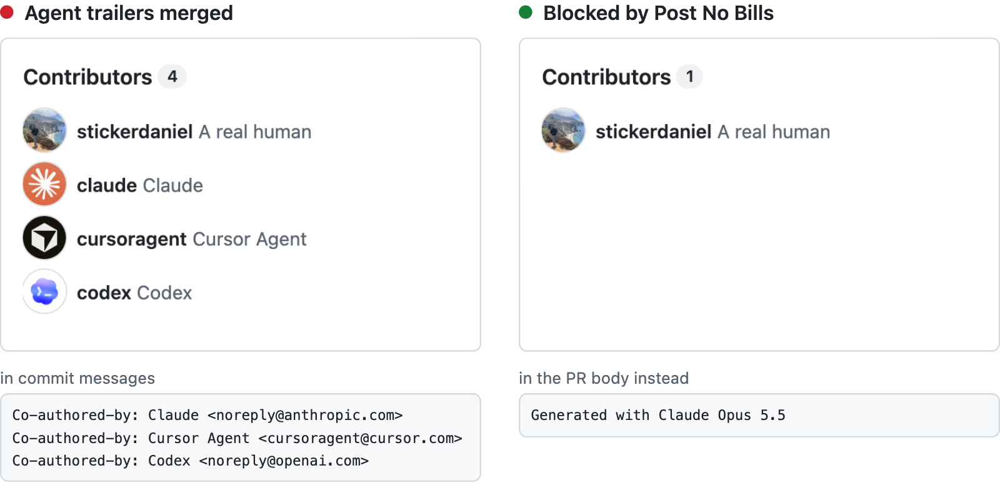

# Post No Bills

[](https://github.com/stickerdaniel/post-no-bills/actions/workflows/ci.yml) [](LICENSE)

Agents write the code, people sign it. Models are disclosed in the PR body.

<br>

<p>
<picture>
  <source media="(prefers-color-scheme: dark)" srcset="docs/hero-dark.png">
  
</picture>
</p>

A coding agent that adds `Co-authored-by: Claude <noreply@anthropic.com>` to a commit signs your repository. Once that trailer reaches your default branch, the agent's account can join your Contributors list, next to the people who wrote the code. Post No Bills is a GitHub Action that fails such pull requests, and asks for a one-line model disclosure in the PR body instead.

## What it catches

- **Agents signing themselves into your history.** A `Co-authored-by` trailer naming a coding agent, in a commit message or the PR body. Squash merging can carry it into your default branch.
- **Commits made under an agent's identity.** A commit authored or committed by a coding agent's address, such as `noreply@anthropic.com`.
- **Text reviewers cannot see.** Zero-width spaces, bidi controls, tag characters, private-use characters, and letters from another script that pass for Latin, in the title, body, commit messages, and added lines. Unusual spaces warn by default.
- **Undisclosed model use.** A PR body whose last non-empty line is not `Generated with <model>`, such as `Generated with Claude Opus 5.5`. Every PR needs it, including one with an empty body or written without an agent, unless its author is exempt.

## Usage

```yaml
name: Post No Bills
on:
  pull_request_target:
    types: [opened, synchronize, reopened, edited]
permissions:
  contents: read
concurrency:
  group: ${{ github.workflow }}-${{ github.event.pull_request.number }}
  cancel-in-progress: true
jobs:
  check-bot-coauthors:
    runs-on: ubuntu-latest
    steps:
      - uses: stickerdaniel/post-no-bills@cf1ab380bfc68079de8113e1a86d2a8350abbc55 # v2.2.0
```

Pin a release SHA. Make `check-bot-coauthors` a required check and give the job no `if:`, because GitHub counts a skipped job as passing.

## Configuration

| Input | Default | Effect |
| --- | --- | --- |
| `require-model-attribution` | `true` | `false` turns off the attribution check. PRs opened by `renovate[bot]` and `dependabot[bot]` are exempt. |
| `co-author-trailers` | `error` | `error`, `warn` or `off` for agent trailers in commit messages and the PR body. |
| `agent-identities` | `error` | `error`, `warn` or `off` for commits authored or committed by an agent's address. |
| `hidden-unicode` | `error` | `error`, `warn` or `off` for invisible and private-use characters. |
| `unicode-homoglyphs` | `inherit` | `inherit`, `error`, `warn` or `off` for look-alike letters. `inherit` follows `hidden-unicode`; any other value applies even when `hidden-unicode` is `off`. |
| `unicode-unusual-spaces` | `inherit` | `inherit`, `error`, `warn` or `off` for unusual spaces. `inherit` warns unless `hidden-unicode` is `off`; any other value applies even then. |
| `unicode-exclude-paths` | empty | Paths whose added lines skip the hidden Unicode check. Literal and case-sensitive; a trailing `/` marks a directory. A pull request can add files there. |
| `allowed-identities` | empty | Addresses that are not agents, as `email:<address>` or `github:<handle>`. A matching exception, not authentication: anyone can put any address in a commit. |
| `additional-identities` | empty | Addresses that are agents besides the built-in list, in the same form. |
| `additional-binary-extensions` | empty | Extensions that may be binary besides the built-in ones, lowercase without a dot. A binary file with such an extension passes unscanned and without a format check; a text file is still scanned. |
| `additional-attribution-exemptions` | empty | PR author logins exempt from the attribution check, and from nothing else. |

Lists take one entry per line:

```yaml
        with:
          unicode-homoglyphs: warn
          unicode-exclude-paths: |
            tests/fixtures/unicode/
            docs/ja.md
          allowed-identities: |
            github:Copilot
          additional-binary-extensions: |
            wasm
```

Set inputs as literals in the workflow on your default branch, never from pull request content such as the title, labels, or branch name.

<details>
<summary>Input rules</summary>

- An `email:` selector matches that address, ignoring ASCII case. A `github:` selector matches the handle's noreply address, with or without its numeric ID, and not a vendor address such as `copilot@github.com`.
- An unknown input name, an invalid value, a repeated entry, or an address both lists can match fails the run. Input names ignore case, as on GitHub.
- No input makes an unreadable file or a reached limit pass.

</details>

## How it works

The workflow and the pinned action come from your default branch. The action fetches the PR into a temporary repository and reads its commits, diff, title, and body as data, without checking out or running anything from the pull request. Every doubt fails the run, including a head that moved since the event.

<details>
<summary>Limits and edge cases</summary>

- Added lines are compared with the merge base. A moved file counts as added.
- A binary file fails unless its extension is `png`, `jpg`, `jpeg`, `gif`, `webp`, `ico`, `pdf`, `zip`, `gz`, `woff`, `woff2`, `ttf`, `otf`, `mp4`, `mov`, `mp3`, `wav`, or listed in `additional-binary-extensions`. Those and submodules are logged as unscanned. The PR's `.gitattributes` cannot change this.
- An invalid UTF-8 path or added line fails, under an excluded path too.
- The run fails, whatever the inputs, past 64 MiB of Git output, two million output records, 600 seconds of Git, 100 million scan steps, 1,000 findings, or four million characters or 100,000 suspicious characters on one line. A rule that is off collects no hits and uses no findings budget; the Git limits, and the scan steps of any rule that is on, still apply.

</details>

## Requirements

A Linux or macOS runner with Python 3.10+ and git 2.31+ on `PATH`. GitHub-hosted Ubuntu runners have both. Windows is not supported.

## License

MIT. `post_no_bills/hidden.py` comes from [no-ai-marks](https://github.com/mishan/no-ai-marks); see [THIRD_PARTY_NOTICES.md](THIRD_PARTY_NOTICES.md).
